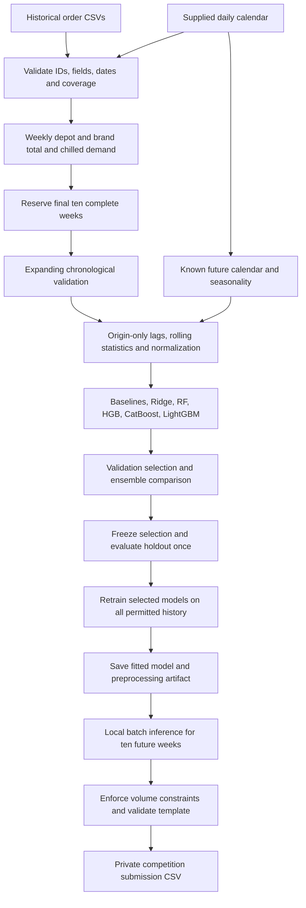

# Local forecasting architecture

Proposed deployment: a local batch command loads the trusted artifact and supplied forecast-input CSV, generates predictions with its stored history and known calendar, and exports validated results. No external hosting is needed. New observations or calendar periods require an explicit refresh and retraining; the saved artifact supports its specified ten-week window.
